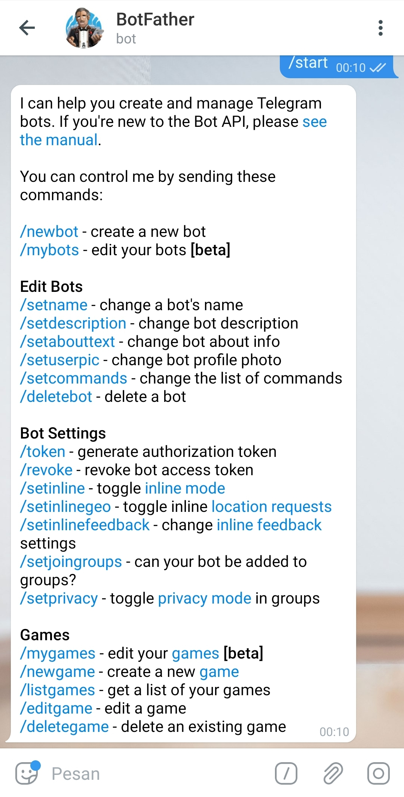
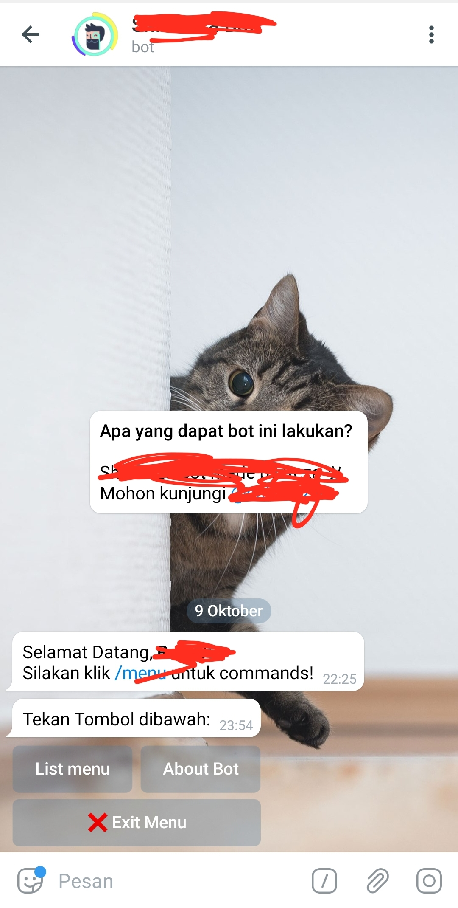

# Telegraf NodeJS


# Termux Setup
<b>Install Ubuntu Andronix</b>
```bash
> pkg update -y && pkg install curl proot tar -y && curl https://raw.githubusercontent.com/AndronixApp/AndronixOrigin/master/Installer/Ubuntu/ubuntu.sh | bash
```
<b>Jalankan Ubuntu</b>
```bash
> ./start-ubuntu.sh
```
<b>Update & Upgrade Ubuntu</b>
```bash
> apt update -y && apt upgrade -y
```
<b>Install Git</b>
```bash
> apt install git -y
```
<b>Cloning ini</b>
```bash
> git clone https://github.com/Shikukiza/telbot
```
<b>Install Nano</b>
```bash
> apt install nano -y
```
<b>Install npm</b>
```bash
> apt install npm -y
```
<b>Install NodeJS</b>
```bash
> apt install nodejs -y
```
<b>Buka Folder telbot</b>
```bash
> cd telbot
```
<b>Install depend telegraf</b>
```bash
> npm install telegraf@3.34
```
<b>Install depend axios</b>
```bash
> npm install axios
```
<b>Mulaikan index.js</b>
```bash
> node index.js
```

13. <b>Dan Enjoy :) Selamat Mencoba!</b>

# Windows 10 Setup

1. <b>Download Visual Studio Code<b>

2. <b>Buka console atau ketik ctrl+`</b>

3. <b>Pastikan sudah install git dan npm</b>

<b>Cloning ini</b>
```bash
> git clone https://github.com/Shikukiza/telbot
```
<b>Buka Folder telbot</b>
```bash
> cd telbot
```
<b>Install depend telegraf</b>
```bash
> npm i telegraf@3.33
```
<b>Install depend axios</b>
```bash
> npm i axios
```

10. </b>Kemudian edit index.js di const bot = ('ISI_TOKEN');</b>


<b>Mulaikan index.js</b>
```bash
> node index.js
```

12. <b>Dan Enjoy :) Selamat Mencoba!</b>

# Contoh Inline!



Kunjungi <a href="https://github.com/Shikukiza/telegraf_bot">Telegraf-Shikukiza</a>
<br/>
Join Juga <a href="https://t.me/shikukiza_nodejs">Grup-Telegram</a>

# Website API
Baca juga bot api <a href="https://core.telegram.org/bots/api">TelegramBot-API</a>
<br>
Pada artikel halaman <a href="https://telegraf.js.org/#/">Telegraf</a>


